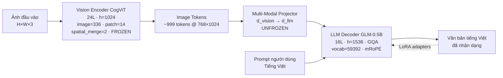
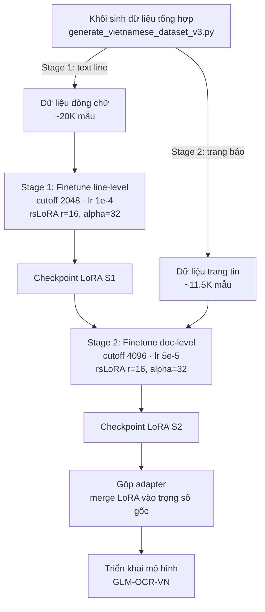

## 3. Tổng quan nghiên cứu

Chương này trình bày bối cảnh học thuật và công nghệ của đề tài. Trước hết, mục 3.1 vạch ra lộ trình tiến hóa của các mô hình nhận dạng văn bản từ kiến trúc CNN–RNN cổ điển đến các mô hình ngôn ngữ thị giác đa modal (Vision–Language Model, VLM) end-to-end. Kế tiếp, mục 3.2 đi sâu vào kiến trúc kỹ thuật của mô hình GLM-OCR được chọn làm đối tượng finetune. Mục 3.3 đặt GLM-OCR bên cạnh pipeline PP-OCRv6 đại diện cho hướng tiếp cận truyền thống, qua đó làm rõ sự khác biệt về triết lý thiết kế. Cuối cùng, mục 3.4 rà soát hiện trạng OCR tiếng Việt, chỉ ra những khoảng trống mà đề tài hướng tới giải quyết.

### 3.1 Mô hình ngôn ngữ thị giác cho OCR: lộ trình tiến hóa

Nhận dạng văn bản trong ảnh (Optical Character Recognition, OCR) đã trải qua gần một thập kỷ chuyển dịch mô hình hình (paradigm shift) từ kiến trúc chuyên biệt (specialized) sang kiến trúc tổng quát dựa trên Transformer và mô hình ngôn ngữ lớn (Large Language Model, LLM). Hình `vlm_ocr_evolution.png` trong kho mã nguồn tóm lược trực quan cho lộ trình này. Bảng 3.1 tóm tắt các cột mốc tiêu biểu.

**Bảng 3.1. Tiến hóa các kiến trúc OCR học sâu (2017–2026).**

| Năm | Kiến trúc tiêu biểu | Đặc trưng chính | Điểm hạn chế |
|-----|--------------------|-----------------|-------------|
| 2017 | CRNN + CTC | CNN trích đặc trưng + RNN hai chiều + giải mã CTC | Mất ngữ cảnh dài hạn, không học ngôn ngữ |
| 2021 | TrOCR | Encoder–decoder Transformer thuần (image → text) | Cần phân từ (BPE), không nhạy layout |
| 2022 | Donut | Transformer-decoder đọc trực tiếp từ patch ảnh | Dữ liệu tổng hợp lớn, chưa xử lý layout phức tạp |
| 2023 | Nougat | Donut chuyên biệt cho tài liệu học thuật (LaTeX) | Overfit ngôn ngữ Toán/LaTeX, yếu với đa layout |
| 2024 | Vary | VLM với vision encoder + LLM decoder, hỗ trợ gốc OCR | Huấn luyện tốn kém, độ chính xác không đồng đều |
| 2026 | GLM-OCR | VLM end-to-end, ViT + Projector + LLM, decode token tiếng Việt trực tiếp | – |

Về mặt đặc trưng kỹ thuật, có thể phân ba hướng tiếp cận như bảng 3.2.

**Bảng 3.2. So sánh đặc trưng giữa ba nhóm kiến trúc OCR.**

| Đặc trưng | CNN–RNN (CRNN) | Transformer-decoder (Donut, Nougat) | VLM end-to-end (GLM-OCR) |
|-----------|----------------|-------------------------------------|--------------------------|
| Trích đặc trưng | CNN tuần tự | Patch embedding + self-attention | ViT lớn, nhị phân hóa sâu |
| Khả năng ngôn ngữ | Không có | Tự hồi quy, vocab cố định | Khả năng suy luận theo ngữ cảnh |
| Xử lý layout | Phụ thuộc module ngoài | Một phần qua self-attention | Tự đối chiếu qua LM decoder |
| Tính linh hoạt | Thấp, đóng khung | Trung bình | Cao, mở rộng bằng prompt |
| Tối ưu cho tiếng Việt | Yếu | Tùy bộ từ vựng | Tốt nếu finetune |

Sự dịch chuyển từ kiến trúc chuyên biệt sang VLM end-to-end phản ánh quan điểm: văn bản trong ảnh không chỉ là chuỗi pixel cần giải mã mà là một dạng ngôn ngữ thị giác có cấu trúc ngữ pháp và ngữ nghĩa. Đó là lý do mô hình GLM-OCR — đối tượng nghiên cứu của đồ án — được lựa chọn: nó cho phép tận dụng tri thức ngôn ngữ có sẵn trong LLM, đồng thời giữ được khả năng đọc trực tiếp từ đặc trưng hình ảnh thông qua cơ chế bridge (projector) học được.

### 3.2 Kiến trúc chi tiết của GLM-OCR

GLM-OCR là mô hình VLM end-to-end có tổng quy mô khoảng 1,1 tỉ tham số (~1.1B params), được cấu thành từ ba module liên tiếp: bộ mã hóa thị giác (Vision Encoder) CogViT, bộ chuyển đổi (Projector) và bộ giải mã ngôn ngữ (LLM decoder) dựa trên GLM-0.5B. Sơ đồ khối được trình bày trong hình `glm_ocr_architecture.png`. Để minh họa trực tiếp trong báo cáo, sơ đồ Mermaid dưới đây tái dựng lại chuỗi xử lý chính.



**Bộ mã hóa thị giác CogViT.** Bộ mã hóa sử dụng kiến trúc ViT với 24 lớp attention, chiều ẩn `hidden_size = 1024`, ảnh đầu vào chuẩn hóa ở kích thước `image_size = 336`, kích thước patch `patch_size = 14`, hệ số gộp không gian `spatial_merge_size = 2` và hệ số gộp thời gian `temporal_patch_size = 2`. Chiều ẩn đầu ra của vision tower là `out_hidden_size = 1536`, khớp với chiều vào của LLM. Việc áp dụng `spatial_merge_size = 2` làm giảm số lượng token thị giác xuống một phần tư, biến ảnh 768×1024 điển hình thành xấp xỉ 999 token thị giác. Theo cách này, mô hình giảm đáng kể chi phí self-attention của LLM mà vẫn giữ độ phân giải không gian đủ để phân biệt dấu thanh tiếng Việt (một dấu mũ, dấu râu, hoặc dấu thanh chỉ chiếm vài pixel).

**Bộ chuyển đổi đa mô thái (Projector).** Projector đóng vai trò cầu nối (bridge) giữa không gian đặc trưng của ViT và không gian embedding của LLM. Đây là module duy nhất có tham số được mở khóa (unfrozen) trong quá trình finetune, và là vị trí then chốt để xây dựng "từ điển thị giác" mới cho hệ thống dấu tiếng Việt. Lý do lựa chọn này được trình bày chi tiết ở mục 4.4.

**Bộ giải mã ngôn ngữ GLM-0.5B.** LLM decoder có 16 lớp, chiều ẩn `hidden_size = 1536`, áp dụng attention nhóm (Grouped Query Attention, GQA) với 16 đầu query và 8 đầu key/value, mỗi đầu có chiều `head_dim = 128`. Bộ từ vựng có kích thước `vocab_size = 59392` đủ lớn để mã hóa ký tự tiếng Việt Unicode tổ hợp. Kích thước tối đa ngữ cảnh là `max_position_embeddings = 131072`, hàm kích hoạt là SiLU, và mô hình áp dụng RoPE với tham số cơ sở `theta = 10000` cùng cấu hình multi-dimensional RoPE `mRoPE = [16, 24, 24]`. Cấu hình mRoPE chia trục vị trí thành ba phần tương ứng với thời gian, chiều cao và chiều rộng, giúp LLM ý thức được cấu trúc không gian 2D của token thị giác.

**Pipeline xử lý tài liệu.** Khi nhận một trang tài liệu, GLM-OCR không tự thực hiện nhận dạng dạng vùng (region detection) trực tiếp, mà phối hợp với mô hình phân vùng bố cục PP-DocLayout-V3. Đầu ra của PP-DocLayout-V3 là tập các vùng (văn bản, bảng, biểu thức, hình vẽ). Sau đó GLM-OCR thực hiện nhận dạng song song (parallel region OCR) trên từng vùng văn bản, giúp tận dụng lợi thế của cả pipeline truyền thống (chia vùng rõ ràng) và VLM (giải mã ngôn ngữ mạnh). Đầu ra của mô hình được tối ưu bằng hàm tổn thất Multi-Token Prediction (MTP), bắt buộc LLM dự đoán nhiều token kế tiếp cùng lúc, tăng cường khả năng học phụ thuộc dài.

Việc nắm rõ kiến trúc này là tiền đề cho các quyết định finetune ở Chương 4, đặc biệt là việc đóng băng vision tower, mở khóa projector, và áp dụng rsLoRA.

### 3.3 So sánh PP-OCRv6 và GLM-OCR

PP-OCRv6 đại diện cho hướng tiếp cận pipeline truyền thống, trong khi GLM-OCR đại diện cho hướng VLM end-to-end. Bảng 3.3 so sánh hai mô hình theo các tiêu chí kỹ thuật quan trọng khi triển khai thực tế.

**Bảng 3.3. So sánh PP-OCRv6 (pipeline truyền thống) và GLM-OCR (VLM end-to-end).**

| Tiêu chí | PP-OCRv6 | GLM-OCR |
|----------|----------|---------|
| Kiến trúc | Tách rời: detection → recognition → ser | VLM thống nhất: ViT + Projector + LLM |
| Số tham số | Vài chục triệu mỗi module | ~1,1 tỉ (1.1B) |
| Độ trễ (1 ảnh) | Thấp (vài chục ms trên CPU) | Cao hơn (cần GPU) |
| Độ chính xác | Cao trên text line đơn giản | Cao trên layout phức tạp, ngữ cảnh dài |
| Tính linh hoạt | Thấp, cần tái huấn luyện từng module | Cao, tùy biến bằng prompt |
| Yêu cầu triển khai | Nhẹ, phù hợp biên (edge) | Nặng, cần GPU VRAM ≥ 8GB |
| Khả năng tiếng Việt | Tốt với text line đã tách | Tốt nếu finetune end-to-end |

Về bản chất, PP-OCRv6 tối ưu cho bài toán *đọc chính xác từng dòng chữ* ở quy mô lớn và chi phí thấp. Mỗi module (det, rec, ser) được huấn luyện độc lập với mục tiêu hẹp. Ngược lại, GLM-OCR đặt câu hỏi rộng hơn: *hiểu trang tài liệu như một vấn đề ngôn ngữ thị giác có cấu trúc*. LLM decoder cho phép mô hình phục hồi lỗi chính tả tiềm ẩn, tổng hợp thông tin giữa các vùng, và xử lý văn bản có phụ thuộc dài (ví dụ tham chiếu bảng–biểu thức). Đổi lại, GLM-OCR cần nhiều tài nguyên tính toán hơn, đặc biệt trong pha suy luận.

Đối với tiếng Việt, đặc biệt là các tài liệu có nhiều dấu thanh và layout phức tạp (hóa đơn, hợp đồng, bài báo), sự kết hợp giữa PP-DocLayout-V3 và GLM-OCR cho ra một pipeline vừa tận dụng được thế mạnh phân vùng của hệ truyền thống, vừa được hưởng lợi thế ngôn ngữ của VLM. Đây là lý do đề tài chọn GLM-OCR làm đối tượng finetune thay vì thay thế hoàn toàn bằng pipeline PP-OCRv6.

### 3.4 Hiện trạng OCR tiếng Việt

Hiện trạng OCR tiếng Việt chủ yếu xoay quanh ba dòng công cụ:

- **PP-OCR (PaddleOCR) cho tiếng Việt**: Được đóng gói kèm mô hình vi nhận dạng tiếng Việt, hoạt động tốt trên text line đã được tách vùng sạch. Hạn chế là mất chính xác khi dòng chữ dài hoặc có dấu thanh mờ, do mô hình rec không có ngữ cảnh ngôn ngữ.
- **VietOCR (kiến trúc Transformer)**: Cung cấp encoder–decoder Transformer cho tiếng Việt, cải thiện đáng kể độ chính xác so với CRNN, nhưng vẫn yêu cầu module detection bên ngoài và không xử lý được layout phức tạp.
- **vietocr toolkit**: Thư viện mã nguồn mở bao bọc VietOCR, dễ sử dụng nhưng giữ nguyên các hạn chế của Transformer thuần: không hiểu cấu trúc trang và không tận dụng được tri thức ngôn ngữ quy mô lớn.

Hạn chế chung của ba hướng trên là *không xử lý tốt context dài và layout phức tạp*. Cụ thể:

1. **Context dài**: Văn bản tiếng Việt có nhiều đồng âm và dấu thanh phân biệt nghĩa, cần ngữ cảnh để giải mã đúng. Mô hình rec thuần (PP-OCR, VietOCR) nhìn từng dòng độc lập, dễ nhầm lẫn khi dấu thanh pixel mờ.
2. **Layout phức tạp**: Tài liệu thực tế chứa bảng, biểu thức, tiêu đề, chú thích đan xen. Pipeline tách rời yêu cầu một module ser riêng để gán vai trò, dễ sai khi cấu trúc trang không đồng nhất.
3. **Hallucination dấu thanh**: Một số mô hình VLM tổng quát khi áp dụng cho tiếng Việt có xu hướng "thêm dấu bừa" vào văn bản không có dấu (như tên riêng tiếng Anh), do chưa được huấn luyện để phân biệt chữ có dấu và không dấu.

GLM-OCR end-to-end, sau khi finetune với dữ liệu tiếng Việt được thiết kế chống ảo giác (anti-hallucination), có tiềm năng giải quyết đồng thời cả ba hạn chế trên. Phương pháp finetune chi tiết được trình bày ở Chương 4.

---

## 4. Phương pháp đề xuất

Chương này trình bày phương pháp finetune GLM-OCR cho OCR tiếng Việt. Mục 4.1 tóm tắt pipeline hai giai đoạn. Mục 4.2 và 4.3 đặt nền toán học cho kỹ thuật LoRA và rsLoRA. Mục 4.4 giải thích lựa chọn đóng băng vision tower và mở khóa projector. Mục 4.5 mô tả bộ dữ liệu v3 với thiết kế chống ảo giác. Cuối cùng, mục 4.6 và 4.7 trình bày chi tiết cấu hình YAML và logic bộ sinh dữ liệu.

### 4.1 Tổng quan pipeline hai giai đoạn

Đồ án áp dụng pipeline finetune hai giai đoạn (two-stage) như minh họa trong hình `finetune_pipeline.png`. Sơ đồ Mermaid dưới đây tái dựng lại pipeline:



Phương pháp hai giai đoạn xuất phát từ quan sát rằng văn bản tiếng Việt có cấu trúc hai cấp:

- **Cấp dòng (line-level)**: Mỗi dòng chữ là một đơn vị có dấu thanh rõ ràng. Giai đoạn 1 tập trung cho mô hình học cách đọc đúng từng dấu thanh trong điều kiện đa font, đa kích thước, có nhiễu nhẹ.
- **Cấp trang (doc-level)**: Một trang tin chứa nhiều dòng, tiêu đề, bảng và bố cục phức tạp. Giai đoạn 2 dạy mô hình cách đối chiếu thông tin giữa các dòng và phục hồi layout. Việc khởi tạo từ checkpoint của Giai đoạn 1 (`adapter_name_or_path: {s1_last}`) giúp mô hình giữ kỹ năng đọc dấu thanh trước khi học kỹ năng đọc trang.

Việc áp dụng rsLoRA ở cả hai giai đoạn, kết hợp với đóng băng vision tower và mở khóa projector, sẽ được giải thích ở các mục kế tiếp.

### 4.2 Toán học của LoRA

Low-Rank Adaptation (LoRA) giả định rằng sự cập nhật trọng số cần thiết cho một nhiệm vụ mới có hạng thấp (low-rank). Cho ma trận trọng số gốc $W_0 \in \mathbb{R}^{d \times k}$ của một lớp tuyến tính, ta không cập nhật trực tiếp $W_0$ mà thêm một hiệu chỉnh $\Delta W$ được phân tích thành tích hai ma trận hạng thấp:

$$
W = W_0 + \Delta W = W_0 + B A, \quad B \in \mathbb{R}^{d \times r}, \ A \in \mathbb{R}^{r \times k}, \quad r \ll \min(d, k).
$$

Trong đó $B$ và $A$ là hai ma trận học được (trainable), còn $W_0$ được giữ cố định (frozen). Ma trận $A$ thường khởi tạo ngẫu nhiên theo phân phối chuẩn, còn $B$ khởi tạo bằng 0, sao cho $\Delta W = BA = 0$ tại thời điểm bắt đầu, đảm bảo mô hình không thay đổi hành vi ban đầu. Hồi tiếp (forward pass) của lớp được viết:

$$
h = W x = W_0 x + \frac{\alpha}{r} B A x,
$$

với $x \in \mathbb{R}^{k}$ là đầu vào và $\alpha$ là hệ số co giãn (scaling). Việc chia cho $r$ nhằm giữ cho phân bố của $\Delta W x$ ổn định khi $r$ thay đổi.

**Giảm số tham số huấn luyện.** Nếu cập nhật trọn vẹn ma trận $W_0$, số tham số cần học là $d \cdot k$. Với LoRA, số tham số giảm xuống $d \cdot r + r \cdot k = r(d + k)$, xấp xỉ $2 \cdot d \cdot r$ khi $d \approx k$. Khi $r \ll \min(d, k)$, sự tiết kiệm là bậc lớn. Ví dụ với $d = k = 1536$ và $r = 16$, số tham số giảm từ $2{,}359{,}296$ xuống khoảng $49{,}152$, tức tiết kiệm gần 48 lần.

**Vì sao phù hợp cho GLM-OCR?** LLM decoder của GLM-OCR có hàng trăm triệu tham số; việc finetune toàn bộ là tốn kém và dễ gây hiện tượng catastrophic forgetting (mất tri thức cũ). LoRA cho phép gắn adapter vào tất cả các lớp tuyến tính (`lora_target: all`) mà vẫn giữ trọng số gốc nguyên vẹn, dễ dàng hồi quy hoặc gộp về sau.

### 4.3 Toán học của rsLoRA

Bản phân chia $\alpha / r$ trong LoRA gốc có một vấn đề khi $r$ lớn: phương sai của gradient tăng theo $r$, dẫn đến huấn luyện bất ổn khi muốn dùng hạng cao để tăng dung lượng adapter. rsLoRA (rank-stabilized LoRA, Kalajdzievski 2023) đề xuất thay hệ số co giãn bằng căn bậc hai:

$$
h = W_0 x + \sqrt{\frac{\alpha}{r}} \, B A x.
$$

Việc dùng $\sqrt{\alpha / r}$ thay cho $\alpha / r$ làm cho phương sai của gradient không còn tỷ lệ thuận với $r$, từ đó cho phép huấn luyện ổn định ở các giá trị $r$ cao hơn mà không cần tinh chỉnh $\alpha$.

**Giải thích trực giác.** Khi tăng $r$, độ lớn của $\Delta W = BA$ có xu hướng tăng vì nhiều thành phần cộng dồn. Hệ số $1/\sqrt{r}$ bù trừ chính xác mức tăng này về mặt cấp số mũ, giữ cho biên độ cập nhật không bùng nổ. Điều này cho phép dùng hạng $r = 16$ (như cấu hình đồ án) với $\alpha = 32$ một cách ổn định, không gặp hiện tượng mất mát (loss) dao động mạnh.

Trong cấu hình YAML, rsLoRA được bật bằng `use_rslora: true`. Các tham số `lora_rank: 16` và `lora_alpha: 32` cho hệ số hiệu dụng $\sqrt{32/16} = \sqrt{2} \approx 1{,}414$, một giá trị vừa đủ để cập nhật đủ mạnh nhưng không gây nổ gradient.

### 4.4 Lý do đóng băng vision tower và mở khóa projector

Quyết định `freeze_vision_tower: true` và `freeze_multi_modal_projector: false` không phải tùy tiện mà dựa trên vai trò chức năng của từng module:

**Đóng băng vision tower (CogViT).** Bộ mã hóa thị giác đã được pretrain trên hàng tỷ cặp ảnh–văn bản và học được các đặc trưng thị giác bậc thấp (cạnh, góc, kết cấu). Dấu thanh tiếng Việt thực chất là tổ hợp các đặc trưng này ở quy mô pixel nhỏ. Nếu mở khóa ViT để finetune, hai rủi ro xảy ra:

1. **Catastrophic forgetting**: Đặc trưng bậc thấp tổng quát bị phá, mô hình kém đi trên các loại ảnh ngoài phân phối dữ liệu finetune.
2. **Chi phí tính toán**: ViT có 24 lớp với hidden 1024, mở khóa thêm rất nhiều tham số và làm chậm đáng kể.

Do đó, đóng băng ViT giữ nguyên tri thức thị giác tổng quát và tiết kiệm tài nguyên.

**Mở khóa projector.** Projector là cầu nối (bridge) giữa không gian đặc trưng của ViT (chiều 1024/1536) và không gian embedding của LLM (chiều 1536). Đây là module duy nhất có khả năng "dịch" đặc trưng thị giác thành token ngôn ngữ. Khi mở khóa projector, mô hình có thể học cách ánh xạ các tổ hợp pixel đặc trưng cho dấu tiếng Việt (ă, â, ê, ô, ơ, ư, ĩ) thành token tương ứng trong LLM, mà không cần đụng đến ViT. Nói cách khác, projector cho phép xây dựng "từ điển thị giác" mới cho hệ thống dấu tiếng Việt, tận dụng đặc trưng đã có của ViT.

Việc kết hợp này là một điểm tinh tế: ta *không dạy lại ViT cách nhìn*, mà *dạy projector cách đọc* những gì ViT đã nhìn. LLM decoder, thông qua adapter LoRA, học cách sử dụng token thị giác mới để sinh văn bản tiếng Việt chính xác.

### 4.5 Thiết kế bộ dữ liệu v3 chống ảo giác

Bộ dữ liệu v3 được thiết kế xoay quanh nguyên tắc *chống ảo giác dấu thanh* (anti-hallucination): mô hình phải biết *khi nào thêm dấu* và *khi nào không*, thay vì thêm dấu bừa cho mọi văn bản. Thiết kế gồm các thành phần sau.

**12 font Windows đã xác minh.** Khác với một số báo cáo nội bộ nhắc tới 58 font, đồ án chỉ sử dụng 12 font thực sự có sẵn và đã được kiểm chứng trên hệ điều hành Windows:

- arial, arialbd, ariali
- times, timesbd, timesi
- calibri, calibrib, calibrii
- tahomabd
- segoeui

Danh sách này đảm bảo khả năng tái lặp của bộ dữ liệu trên máy người dùng cuối, vốn cũng chạy Windows.

**7 bộ sinh Stage 1 với trọng số.** Bảy chiến lược sinh dòng chữ có trọng số khác nhau, tổng cộng quy về 100%:

| Bộ sinh | Trọng số | Mục đích |
|---------|---------|----------|
| `word_list` | 10% | Từ vựng lấy từ danh sách có chủ đề |
| `phrase_list` | 15% | Cụm từ ngắn, học phụ thuộc cục bộ |
| `confusion` | 20% (cao nhất) | Cặp từ sai khác 1 ký tự (edit-distance = 1), rèn phân biệt dấu thanh tinh tế |
| `grouped` | 10% | Từ được nhóm theo chủ đề |
| `mixed` | 15% | Trộn ngẫu nhiên các nguồn |
| `dense` | 10% | Text dày đặc, rèn đọc layout |
| `plain_words` | 20% | Từ không dấu, chống khuynh hướng thêm dấu bừa |

Việc `confusion` nhận trọng số cao nhất (20%) phản ánh mục tiêu cốt lõi: phân biệt dấu thanh tinh tế. Cặp từ như "ba–bá", "ma–mà–mả–mã–mạ" sai khác đúng một ký tự nhưng khác nghĩa hoàn toàn; mô hình cần học sắc bén ở mức pixel. Trọng số 20% cho `plain_words` cân bằng lại: nếu dữ liệu chỉ chứa từ có dấu, mô hình dễ bị khuynh hướng thêm dấu vào cả văn bản không dấu (tên riêng tiếng Anh, số liệu).

**88 ENGLISH_WORDS.** Một danh sách 88 từ tiếng Anh phổ biến được chèn vào dữ liệu Stage 1. Mục đích là dạy mô hình *không thêm dấu tiếng Việt* vào văn bản tiếng Anh — một dạng ảo giác rất hay gặp khi finetune VLM cho ngôn ngữ có dấu. Khi gặp từ như "Hello" hay "System", mô hình phải học giữ nguyên dạng không dấu thay vì biến thành "Hellô" hay "Systêm".

**Augmentation 20 slot.** Phép tăng cường dữ liệu được chia thành 20 ô (slot) với phân bố sau:

| Loại augment | Số slot | Tỉ lệ | Thông số |
|--------------|---------|-------|----------|
| `none` (không augment) | 13 | 65% | – |
| `blur` (làm mờ) | 2 | 10% | độ mờ 0,3–0,6 |
| `noise` (nhiễu) | 2 | 10% | cường độ 10–25 |
| `jpeg` (nén JPEG) | 2 | 10% | chất lượng Q65–Q85 |
| `rotate` (xoay) | 1 | 5% | ±2° |

Tổng 35% mẫu được tăng cường, 65% giữ sạch. Lí do tỉ lệ augment thấp và nhẹ là *dấu thanh tiếng Việt chỉ chiếm vài pixel*: nếu xoay mạnh, nén JPEG quá mức hoặc làm mờ sâu, dấu thanh có thể biến mất hoàn toàn và biến nhãn thành sai lệch (label noise), gây phản tác dụng. Tỉ lệ 65% sạch đảm bảo mô hình học đúng dấu thanh trước, và 35% augment giúp tổng quát hóa trên điều kiện ảnh thực tế.

**6 nhóm dấu thanh.** Sáu nhóm dấu thanh tiếng Việt được theo dõi riêng để đảm bảo cân bằng: ă/â, ê, ô, ơ, ư, và ĩ (dấu móc trên của chữ i). Mỗi nhóm được sinh với tần suất tương đương để tránh mô hình thiên vị nhóm phổ biến hơn.

**Khử trùng lặp và viết hoa ngẫu nhiên.** Bộ dữ liệu áp dụng khử trùng lặp theo `unique(text)` để tránh một mẫu xuất hiện quá nhiều lần. Việc viết hoa ngẫu nhiên theo 5 chế độ (ví dụ: ALL CAPS, Title Case, lower case, Sentence case, ngẫu nhiên ký tự đầu) giúp mô hình quen với đa dạng kiểu gõ.

**Crawler Stage 2.** Đối với dữ liệu trang báo (Stage 2), một bộ thu thập nội dung (crawler) lấy tin tức từ 15 nguồn RSS: 10 nguồn VNExpress, 4 nguồn Tuổi Trẻ và 1 nguồn Thanh Niên. Sau khi lấy về, bộ tiền xử lý *bỏ ngẫu nhiên 30% dấu thanh* trong văn bản, và nhãn gốc (có đầy đủ dấu) được giữ làm target. Đây là một chiến thuật *củng định chống ảo giác*: mô hình học phục hồi dấu từ một ảnh mà nội dung đã bị tước dấu một phần, buộc nó phải đọc đúng những gì thấy trong ảnh thay vì suy luận thêm dấu theo ngữ nghĩa.

Tổng kết, bộ dữ liệu v3 là một hệ thống được thiết kế có chủ đích để giải quyết ba vấn đề nêu ở mục 3.4: đọc đúng dấu thanh (`confusion` 20%), không thêm dấu bừa (`plain_words` 20%, 88 ENGLISH_WORDS), và phục hồi dấu từ dữ liệu nhiễu (Stage 2 strip 30%).

### 4.6 Cấu hình YAML cho hai giai đoạn finetune

Các cấu hình dưới đây được sao chép nguyên vẹn từ file cấu hình thực tế của đồ án.

**Cấu hình Stage 1 — `glm_ocr_vn_s1_rslora.yaml`.**

```yaml
# Stage 1 (glm_ocr_vn_s1_rslora.yaml)
finetuning_type: lora
lora_rank: 16
lora_alpha: 32
lora_dropout: 0.1
use_rslora: true
lora_target: all
freeze_vision_tower: true
freeze_multi_modal_projector: false
cutoff_len: 2048
per_device_train_batch_size: 8
gradient_accumulation_steps: 8   # effective batch 64
learning_rate: 1.0e-4
lr_scheduler_type: constant_with_warmup
warmup_ratio: 0.05
num_train_epochs: 3
fp16: true
eval_steps: 200
early_stopping_patience: 3
```

Một số điểm đáng chú ý của Stage 1:

- `cutoff_len: 2048` đủ chứa ảnh dòng chữ (khoảng 999 token thị giác) cộng prompt và nhãn.
- `learning_rate: 1.0e-4` lớn hơn so với Stage 2, vì đây là lần đầu adapter học dấu tiếng Việt.
- `early_stopping_patience: 3` cho phép dừng sớm nếu CER không cải thiện sau 3 lần đánh giá liên tiếp, tránh overfit.

**Cấu hình Stage 2 — `glm_ocr_vn_s2_rslora.yaml`.**

```yaml
# Stage 2 (glm_ocr_vn_s2_rslora.yaml)
adapter_name_or_path: {s1_last}   # load S1 checkpoint
finetuning_type: lora
lora_rank: 16
lora_alpha: 32
use_rslora: true
lora_target: all
freeze_vision_tower: true
freeze_multi_modal_projector: false
cutoff_len: 4096
per_device_train_batch_size: 2
gradient_accumulation_steps: 8   # effective batch 16
learning_rate: 5.0e-5
num_train_epochs: 1
lr_scheduler_type: constant_with_warmup
warmup_ratio: 0.05
fp16: true
```

So với Stage 1, Stage 2 có ba thay đổi chính:

1. `cutoff_len: 4096` tăng lên để chứa trang báo nhiều dòng.
2. `per_device_train_batch_size: 2` giảm xuống do mỗi mẫu lớn hơn, kèm `gradient_accumulation_steps: 8` cho effective batch 16.
3. `learning_rate: 5.0e-5` giảm một nửa, vì adapter đã được khởi tạo từ Stage 1 và chỉ cần tinh chỉnh nhẹ.

Cả hai giai đoạn đều giữ `freeze_vision_tower: true` và `freeze_multi_modal_projector: false` vì lý do đã nêu ở mục 4.4.

### 4.7 Logic bộ sinh dữ liệu (trích từ `generate_vietnamese_dataset_v3.py`)

Dưới đây là hai hàm tiêu biểu thể hiện thiết kế chống ảo giác. Đoạn mã được rút gọn để trình bày, nhưng logic cốt lõi được giữ nguyên.

**Hàm `gen_plain_words` — sinh từ không dấu, chống thêm dấu bừa.**

```python
def gen_plain_words(plain_word_pool, english_words, rng, n=1):
    """
    Sinh mẫu 'plain words' để dạy mô hình KHÔNG thêm dấu tiếng Việt
    vào văn bản không có dấu (ví dụ: tên riêng tiếng Anh, số liệu).

    plain_word_pool : danh sách từ tiếng Việt không dấu
    english_words   : danh sách 88 từ tiếng Anh phổ biến
    """
    samples = []
    for _ in range(n):
        # 50% lấy từ không dấu tiếng Việt, 50% lấy từ tiếng Anh
        if rng.random() < 0.5:
            word = rng.choice(plain_word_pool)
        else:
            word = rng.choice(english_words)
        # Nhãn chính là chính từ đó — không thêm dấu
        text = word
        # Ghi nhận metadata để downstream biết đây là mẫu anti-hallucination
        samples.append({
            "text": text,
            "label": text,           # nhãn = text, buộc mô hình đọc đúng
            "anti_hallucination": True,
        })
    return samples
```

Ý tưởng then chốt: nhãn (`label`) bằng đúng văn bản nguồn (`text`), buộc mô hình phải *đọc chính xác những gì nhìn thấy* thay vì *đoán thêm dấu theo ngữ nghĩa*. Đây là thành phần đối trọng cho `confusion`, giữ mô hình cân bằng giữa "biết thêm dấu khi cần" và "không thêm dấu khi không cần".

**Hàm `augment` — tăng cường dữ liệu nhẹ.**

```python
def augment(image, rng, slots=20):
    """
    Áp dụng augmentation nhẹ theo khe (slot).
    13/20 = 65% không augment (giữ sạch để bảo toàn dấu thanh).
    2/20  = 10% blur  (sigma 0.3-0.6)
    2/20  = 10% noise (intensity 10-25)
    2/20  = 10% jpeg  (quality 65-85)
    1/20  = 5%  rotate(±2 độ)
    """
    slot = rng.randint(0, slots - 1)
    if slot < 13:
        return image                       # 65% — giữ nguyên
    elif slot < 15:
        sigma = rng.uniform(0.3, 0.6)
        return gaussian_blur(image, sigma)  # 10% — blur nhẹ
    elif slot < 17:
        intensity = rng.randint(10, 25)
        return add_noise(image, intensity)  # 10% — noise nhẹ
    elif slot < 19:
        quality = rng.randint(65, 85)
        return jpeg_compress(image, quality)  # 10% — jpeg nhẹ
    else:
        angle = rng.uniform(-2.0, 2.0)
        return rotate(image, angle)         # 5% — xoay nhẹ ±2 độ
```

Việc chia augmentation thành 20 khe rời rạc cho phép kiểm soát xác suất chính xác mỗi loại, đồng thời giữ 65% mẫu hoàn toàn sạch. Đặc tính này quan trọng với tiếng Việt vì dấu thanh (như dấu mũ trên â, dấu râu trên ơ, dấu móc trên ư) chiếm rất ít pixel; augmentation quá mạnh sẽ xóa nhòa dấu và tạo nhãn sai.

**Tổng kết phương pháp.** Phương pháp đề xuất là sự kết hợp chặt chẽ giữa (i) kiến trúc GLM-OCR với quyết định đóng băng ViT, mở khóa projector, (ii) kỹ thuật rsLoRA với hạng $r = 16$ ổn định, và (iii) bộ dữ liệu v3 được thiết kế chống ảo giác ở mọi tầng (từ vựng, augmentation, crawler). Kết quả thực nghiệm trên hai giai đoạn (Stage 1 CER 2,01% / DA 89,4%; Stage 2 CER 0,42% / DA 97,6%) sẽ được phân tích chi tiết ở Chương 5.
